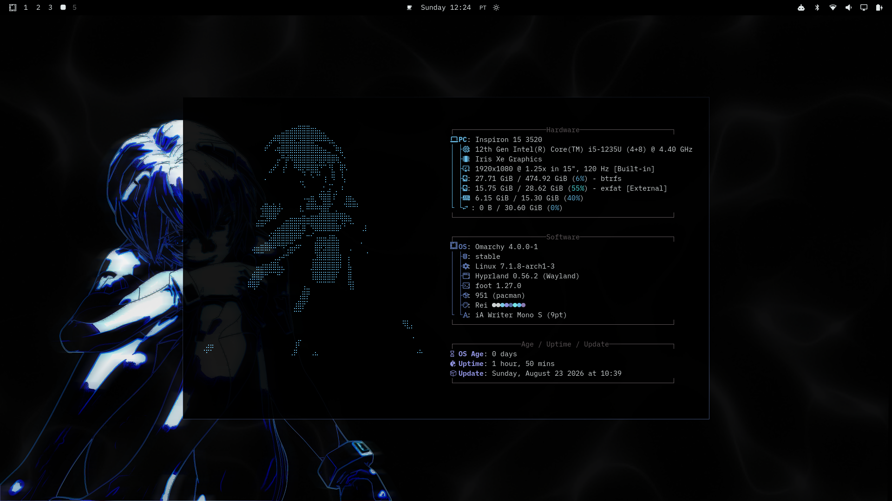
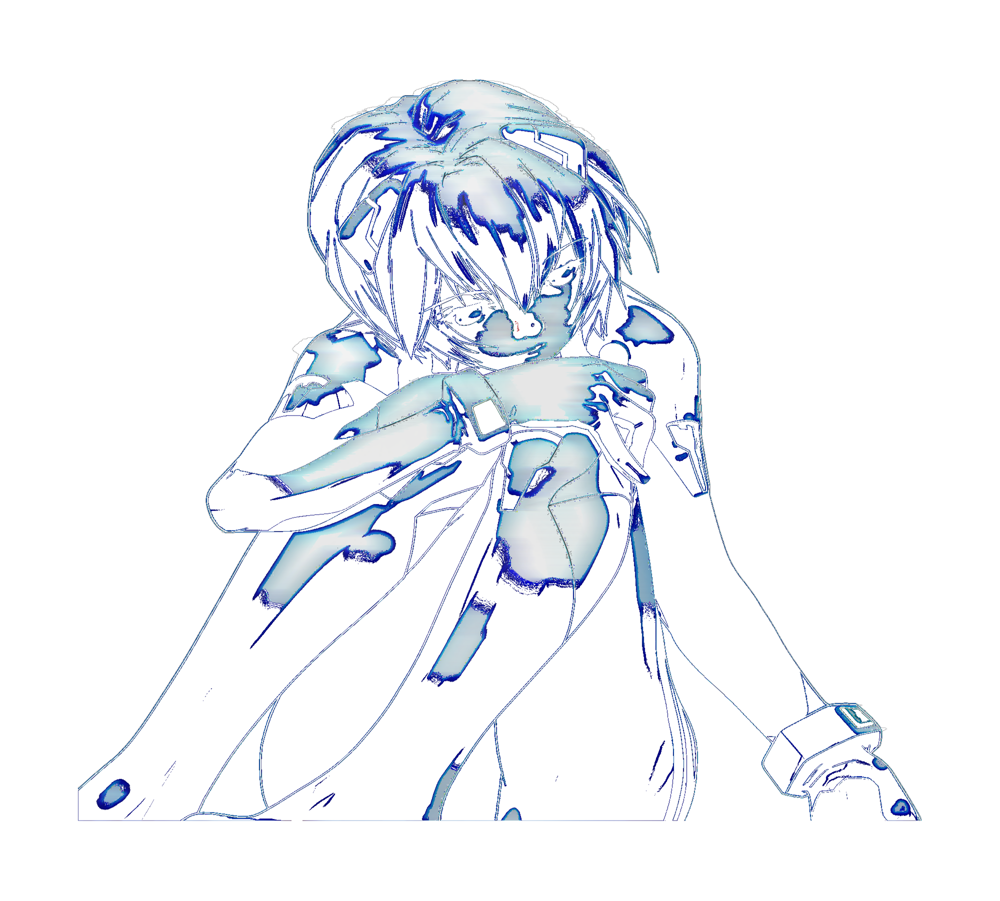
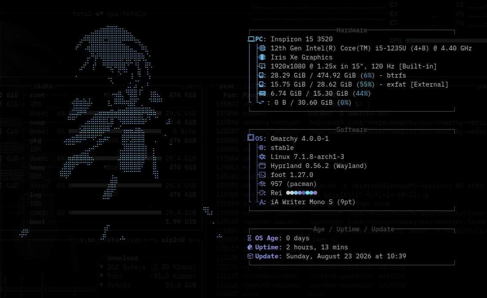

# Rei



## Inspiration

Named after and inspired by **Rei Ayanami** from *Neon Genesis Evangelion* —
her signature light blue hair and eyes are the seed for this palette. The
theme leans on a single muted blue (`#617bb9`) as the accent across the
terminal, window borders, and UI, echoing her cold, quiet color scheme
against a near-black background.


This character cutout — extracted from the theme's wallpaper with a
transparent background — doubles as the thumbnail Omarchy's theme switcher
(`Super + Shift + Ctrl + Space`) shows for this theme, since it drops in as
`preview.png` at the theme's root (Omarchy looks for that file automatically,
no extra config needed).

## Install

```bash
omarchy theme install https://github.com/eduardofrafre/omarchy-rei-theme
```

This gives you the color palette, icon theme, wallpaper, and a gradient
window-border color driven straight from `colors.toml` (see below).

## Matching the border style and window transparency

The screenshot's transparent, thin, gradient window borders and the
slightly see-through terminal/editor come from two places: one is baked
into this theme, the other is a personal Hyprland preference you'll need to
add yourself.

**Already included when you install this theme** — the border gradient
(transparent → `#617bb9` at ~70% opacity, 45°) is defined in `colors.toml`
via Omarchy's `hyprland_active_border` / `hyprland_inactive_border` keys,
and applies automatically to window borders (`general.col`) and window
group/tab borders (`group.col`):

```toml
hyprland_active_border = "rgba(617bb900) rgba(617bb9b3) 45deg"
hyprland_inactive_border = "rgba(617bb955)"
```

**Not part of the theme (add to your own `~/.config/hypr/` files)** —
border thickness isn't a theme color, so it lives in your personal
`~/.config/hypr/looknfeel.lua`:

```lua
hl.config({
  general = {
    border_size = 1,
  },
})
```

And the slight transparency on terminals and VS Code is a personal window
rule in `~/.config/hypr/hyprland.lua`:

```lua
-- Slight transparency for terminals and the IDE (active/inactive opacity).
o.window({ tag = "terminal" }, { opacity = "0.90 0.85" })
o.window("^(code)$", { opacity = "0.90 0.85" })
```

After editing either file, Hyprland picks up the change on save — run
`hyprctl reload` to force it, and `hyprctl configerrors` to confirm there
are no typos.

## Using the character as a fastfetch logo



`ascii-logo.png` is the same character cutout, but with the black
clothing/shadow areas also made transparent — leaving just the blue outline
and highlights — and pre-squashed vertically (~11%) to counteract most
terminals rendering images slightly taller than wide when mapped onto
monospace character cells. Point fastfetch's logo at it in
`~/.config/fastfetch/config.jsonc`:

```jsonc
{
  "logo": {
    "type": "sixel", // or "kitty" / "chafa" / "auto", depending on your terminal
    "source": "~/.local/state/omarchy/current/theme/ascii-logo.png"
  }
}
```

If your terminal or font metrics stretch it a bit differently than shown
here, resize the source image's height up or down a few percent to
compensate — the squash factor isn't universal across terminals/fonts.



## Support

Rei is free and stays free. If it saved you time, you can [support it on PayPal](https://www.paypal.com/donate/?hosted_button_id=N2T3FKPS2Z7DQ).

More of my work: [eduardofrafre.com](https://eduardofrafre.com), with developer tools at [tools.eduardofrafre.com](https://tools.eduardofrafre.com).

## License

[MIT](LICENSE)
